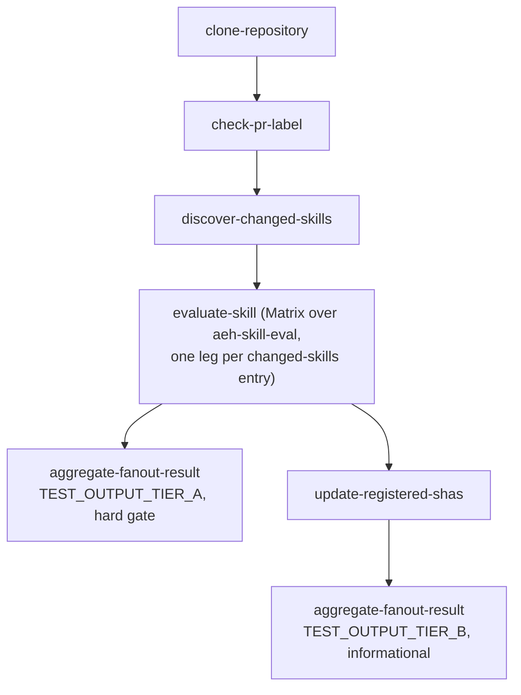

# End-to-end usage: a skills-evaluation pipeline

This walks through how all five tasks in this repo compose together, using
the exact wiring [agentic-plugins](https://gitlab.cee.redhat.com/ai5-marketplace/agentic-plugins)
itself uses in its `.tekton/skills-evaluation-push.yaml` /
`.tekton/skills-evaluation-pull-request.yaml` PipelineRuns -- just with
`taskRef.resolver: bundles` instead of a `git` resolver pinned at this
repo's own revision.

If you're building a different catalog-evaluation pipeline, the only parts
you'll need to change are the five `git-*`/`gitlab-*` params on
`check-pr-label`/`discover-changed-skills`/`update-registered-shas` (see
each task's own `README.md`), and the `scripts/*.py` files those three
tasks expect to find in *your* repository (not bundled in the Task image --
see [Reusability scope](../../README.md#reusability-scope)).

## The shape of the pipeline



`check-pr-label` is only needed on a push-to-main pipeline (it gates the
LLM-cost Tier B chain behind a merged MR's label); a pull-request pipeline
can skip straight to `discover-changed-skills` and pass `should-evaluate:
"false"` as a static value into the Matrix, so only the always-on Tier A
checks run pre-merge.

## 1. Discover what changed

```yaml
- name: discover-changed-skills
  runAfter: [clone-repository]
  taskRef:
    resolver: bundles
    params:
    - {name: name, value: discover-changed-skills}
    - {name: bundle, value: "quay.io/ecosystem-appeng/konflux-skill-evaluation/discover-changed-skills:0.1.0@sha256:808fe417936820aedfab210a3bc3e0a0e01aaf45696b6a4d99aa7457fe92dcf0"}
    - {name: kind, value: task}
  params:
  - {name: current-sha, value: "$(params.revision)"}
  workspaces:
  - {name: source, workspace: orchestrator-workspace}
```

Leaving `git-clone-url`/`detect-script-path`/`git-token-secret-name` at
their defaults reproduces agentic-plugins' own behavior exactly; pass
explicit values to point at your own repository instead.

## 2. Fan out the evaluation

```yaml
- name: evaluate-skill
  runAfter: [discover-changed-skills]
  matrix:
    params:
    - name: submission-dir
      value: $(tasks.discover-changed-skills.results.changed-skills[*])
  taskRef:
    resolver: bundles
    params:
    - {name: name, value: aeh-skill-eval}
    - {name: bundle, value: "quay.io/ecosystem-appeng/konflux-skill-evaluation/aeh-skill-eval:0.1.0@sha256:0415374785a418acca32bb45471a80709086f585d040186f2b0be87b5ff5d89c"}
    - {name: kind, value: task}
  params:
  - {name: submission-revision, value: "$(params.revision)"}
  - {name: source-artifact, value: "$(tasks.clone-repository.results.SOURCE_ARTIFACT)"}
  - {name: should-evaluate, value: "$(tasks.check-pr-label.results.should-evaluate)"}
  - {name: changed-skills, value: $(tasks.discover-changed-skills.results.changed-skills[*])}
  - {name: enable-persistence, value: "true"}
  workspaces:
  - {name: source, workspace: shared-workspace}
```

Every leg always runs Tier A (security/`SKILL.md` scan); Tier B (the LLM
chain) only runs when `should-evaluate` AND that leg's own membership in
`changed-skills` are both true -- see
[task/aeh-skill-eval/README.md](../../task/aeh-skill-eval/README.md).

## 3. Gate on Tier A, hard

```yaml
- name: gate-tier-a-results
  runAfter: [evaluate-skill]
  taskRef:
    resolver: bundles
    params:
    - {name: name, value: aggregate-fanout-result}
    - {name: bundle, value: "quay.io/ecosystem-appeng/konflux-skill-evaluation/aggregate-fanout-result:0.1.0@sha256:bc68d175c2a61dc5c90f5cd578bae824932376adace7349c782fab1dad883649"}
    - {name: kind, value: task}
  params:
  - {name: SOURCE_ARTIFACT, value: "$(tasks.clone-repository.results.SOURCE_ARTIFACT)"}
  - {name: changed-skills, value: $(tasks.discover-changed-skills.results.changed-skills[*])}
  - {name: eval-outcomes, value: $(tasks.evaluate-skill.results.TEST_OUTPUT_TIER_A[*])}
  - {name: fail-on-non-success, value: "true"}
```

## 4. Bump registered SHAs, then report Tier B informationally

```yaml
- name: update-registered-shas
  runAfter: [evaluate-skill]
  taskRef:
    resolver: bundles
    params:
    - {name: name, value: update-registered-shas}
    - {name: bundle, value: "quay.io/ecosystem-appeng/konflux-skill-evaluation/update-registered-shas:0.1.0@sha256:de91b167f45481b8de74641e5abeeb82f2c7cb16f602ee6bcddfa8ff496ad316"}
    - {name: kind, value: task}
  params:
  - {name: current-sha, value: "$(params.revision)"}
  - {name: should-evaluate, value: "$(tasks.check-pr-label.results.should-evaluate)"}
  - {name: changed-skills, value: $(tasks.discover-changed-skills.results.changed-skills[*])}
  - {name: eval-outcomes, value: $(tasks.evaluate-skill.results.TEST_OUTPUT_TIER_B[*])}
  workspaces:
  - {name: source, workspace: orchestrator-workspace}

- name: emit-eval-result
  runAfter: [update-registered-shas]
  taskRef:
    resolver: bundles
    params:
    - {name: name, value: aggregate-fanout-result}
    - {name: bundle, value: "quay.io/ecosystem-appeng/konflux-skill-evaluation/aggregate-fanout-result:0.1.0@sha256:bc68d175c2a61dc5c90f5cd578bae824932376adace7349c782fab1dad883649"}
    - {name: kind, value: task}
  params:
  - {name: SOURCE_ARTIFACT, value: "$(tasks.clone-repository.results.SOURCE_ARTIFACT)"}
  - {name: should-evaluate, value: "$(tasks.check-pr-label.results.should-evaluate)"}
  - {name: changed-skills, value: $(tasks.discover-changed-skills.results.changed-skills[*])}
  - {name: eval-outcomes, value: $(tasks.evaluate-skill.results.TEST_OUTPUT_TIER_B[*])}
  # fail-on-non-success left at its default "false" -- informational only
```

## Secrets and workspaces this whole pipeline needs

Beyond each task's own Secrets table (see each `task/*/README.md`), the
*calling* pipeline needs:

- A `git-auth` workspace Secret for Konflux's own `git-clone-oci-ta` step
  (unrelated to this repo's tasks -- standard Konflux build-pipeline
  plumbing).
- A `shared-workspace` PVC-backed workspace shared by every `evaluate-skill`
  Matrix leg.
- An `orchestrator-workspace` PVC-backed workspace, kept separate from
  `shared-workspace` so the single bookkeeping clone
  (`discover-changed-skills`/`update-registered-shas`) never collides with
  the matrix legs' own per-leg scratch directories.
